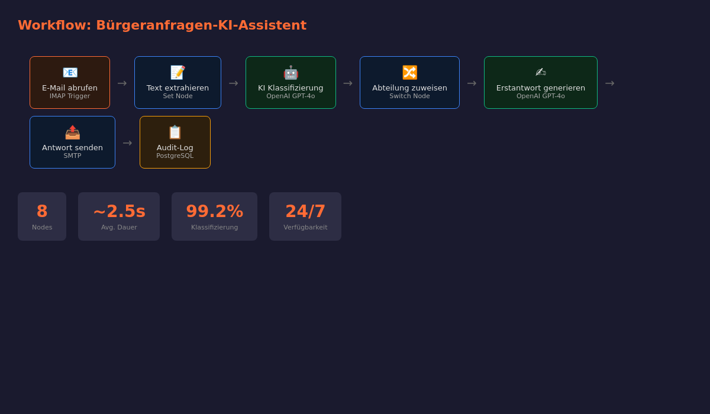
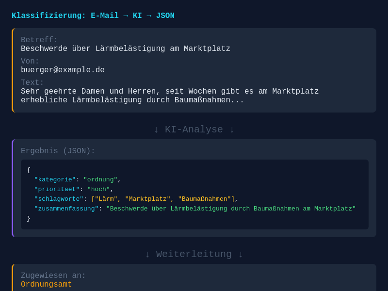
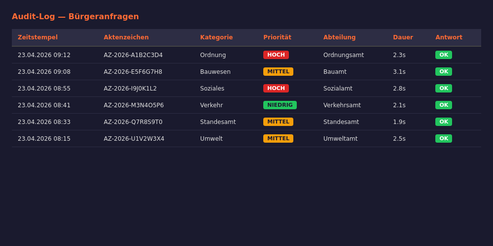
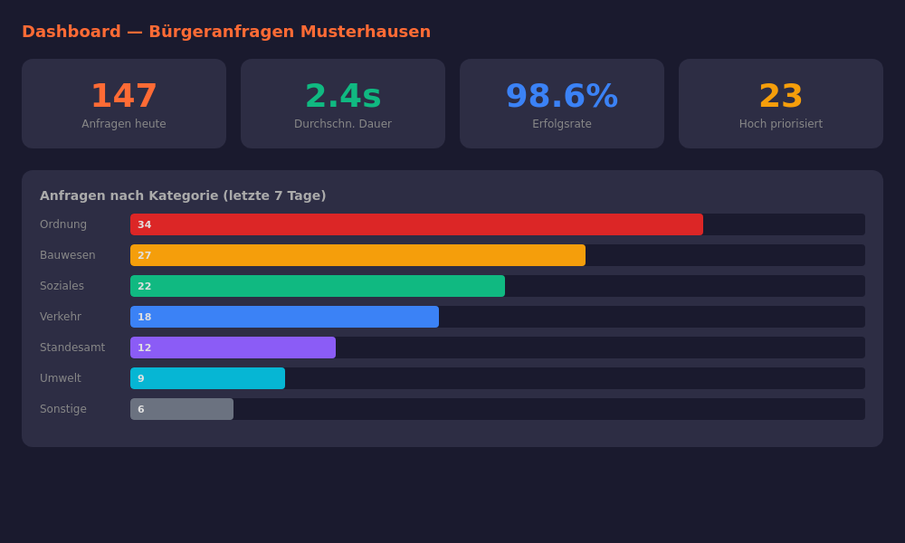

# Bürgeranfragen-KI-Assistent – Automatische Klassifizierung & Weiterleitung


> 🏛️ **KI-gestützte Bürgeranfragen-Verarbeitung für deutsche Behörden** — Automatische Klassifizierung, Abteilungszuweisung und Erstantwort-Generierung. Vollständig self-hosted und DSGVO-konform.

---

## 🎯 Problem & Lösung

### Das Problem
Kommunen und Behörden erhalten täglich Hunderte Bürgeranfragen per E-Mail. Die manuelle Verteilung an die richtige Abteilung kostet Zeit, verzögert Antworten und führt zu Frustration bei Bürgerinnen und Bürgern.

### Die Lösung
Der Bürgeranfragen-KI-Assistent analysiert eingehende E-Mails automatisch, klassifiziert sie nach Kategorie und Priorität, leitet sie an die zuständige Abteilung weiter und generiert eine professionelle Erstantwort — alles auf Ihrer eigenen Infrastruktur, DSGVO-konform und ohne Datenabfluss.

---

## ✨ Features

| Feature | Beschreibung |
|---------|-------------|
| 🤖 **KI-Klassifizierung** | Automatische Kategorisierung in 10 Verwaltungsbereiche |
| 📊 **Priorisierung** | Hoch/Mittel/Niedrig basierend auf Dringlichkeit und Inhalt |
| 🏢 **Abteilungszuweisung** | Automatische Weiterleitung an zuständige Fachbereiche |
| 📝 **Erstantwort** | Formulargerechte Erstantwort im Behördenstil |
| 📋 **Audit-Log** | Vollständige Protokollierung aller Verarbeitungsschritte |
| 🔒 **DSGVO-Konform** | Kein Datenabfluss, vollständige Dokumentation |
| 🐳 **Docker Ready** | Ein-Kommando-Deployment |
| 🔧 **Konfigurierbar** | Abteilungen, Vorlagen und Kategorien anpassbar |

---

## 🏗️ Architektur

```
┌─────────────┐    ┌──────────────┐    ┌─────────────┐
│  E-Mail-    │───▶│  n8n         │───▶│  KI-Modul   │
│  Postfach   │    │  Workflow    │    │  (OpenAI/   │
│  (IMAP)     │    │  Engine      │    │   Ollama)   │
└─────────────┘    └──────┬───────┘    └──────┬──────┘
                          │                   │
                    ┌─────▼─────┐       ┌─────▼─────┐
                    │ PostgreSQL │       │  Kategorien│
                    │ Audit-Log  │       │  Mapping   │
                    └───────────┘       └───────────┘
                          │
                    ┌─────▼─────┐
                    │  Abteilungs-│
                    │  E-Mail    │
                    │  (SMTP)    │
                    └───────────┘
```

---

## 🚀 Quick Start

### Voraussetzungen
- Docker & Docker Compose
- E-Mail-Postfach mit IMAP/SMTP-Zugang
- OpenAI API-Key oder lokaler Ollama-Server

### Installation

```bash
# Repository klonen
git clone https://github.com/ceeceeceecee/buergeranfragen-ki-assistent.git
cd buergeranfragen-ki-assistent

# Umgebungsvariablen konfigurieren
cp .env.example .env
# .env bearbeiten und Ihre Werte eintragen

# Docker Compose starten
docker compose up -d
```

### n8n Workflow importieren

1. n8n unter `http://localhost:5678` öffnen
2. Workflow aus `workflow/buergeranfragen-assistent.json` importieren
3. IMAP- und SMTP-Credentials konfigurieren
4. OpenAI/Ollama-Credentials einrichten
5. Workflow aktivieren

---

## 📸 Screenshots


*Workflow-Übersicht im n8n Editor*


*E-Mail-Klassifizierung durch die KI*


*Nachvollziehbare Audit-Logs aller Anfragen*


*Statistiken und Übersicht aller Anfragen*

---

## 🔒 Datenschutz & DSGVO

### ⚠️ DSGVO-Konformität ist Kern dieses Projekts

- **Kein Datenabfluss:** Alle Daten bleiben auf Ihrer Infrastruktur
- **Löschkonzept:** Automatische Löschung nach konfigurierbarem Zeitraum
- **Audit-Trail:** Jede Verarbeitungsschritt wird protokolliert
- **Drittanbieterfrei:** Optional lokaler KI-Server (Ollama) statt Cloud-API
- **Dokumentation:** Vollständige Datenschutzbeschreibung beiliegend

👉 [Datenschutz-Dokumentation](docs/datenschutz.md)

---

## 🏛️ Use Cases für Behörden

| Szenario | Beschreibung |
|----------|-------------|
| **Stadtverwaltung** | Bürgeranfragen zentral erfassen und an Fachämter verteilen |
| **Landratsamt** | Regionale Anfragen nach Themenbereichen sortieren |
| **Bürgeramt** | Terminanfragen, Dokumentenwünsche und Auskünfte automatisieren |
| **Ordnungsamt** | Beschwerden und Meldungen priorisieren |
| **Bauamt** | Bauanfragen und Genehmigungsanfragen vorfiltern |

---

## 🗺️ Roadmap

- [x] Basis-Workflow mit IMAP/SMTP
- [x] KI-Klassifizierung (10 Kategorien)
- [x] Erstantwort-Generierung
- [x] Audit-Log mit PostgreSQL
- [x] Docker-Deployment
- [ ] Web-Dashboard für Sachbearbeiter
- [ ] Ollama-Integration für Offline-Betrieb
- [ ] Mehrsprachige Anfragen-Erkennung
- [ ] Schnittstelle zu gängigen Verwaltungssoftware (z.B. Fabasoft, ELO)
- [ ] Bürgerportal-Integration

---

## 🤝 Contributing

Beiträge sind willkommen! Bitte beachten Sie:

1. Fork des Repositories erstellen
2. Feature-Branch anlegen (`git checkout -b feature/neues-feature`)
3. Änderungen committen (`git commit -m 'Neues Feature hinzugefügt'`)
4. Branch pushen (`git push origin feature/neues-feature`)
5. Pull Request erstellen

---

## 📄 Lizenz

Dieses Projekt steht unter der [MIT-Lizenz](LICENSE).

---

## 👤 Autor

**Cela** — Freelancer für digitale Verwaltungslösungen

[GitHub](https://github.com/ceeceeceecee)
