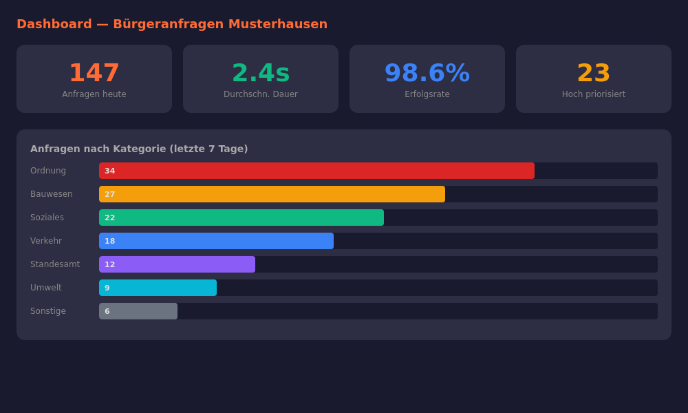
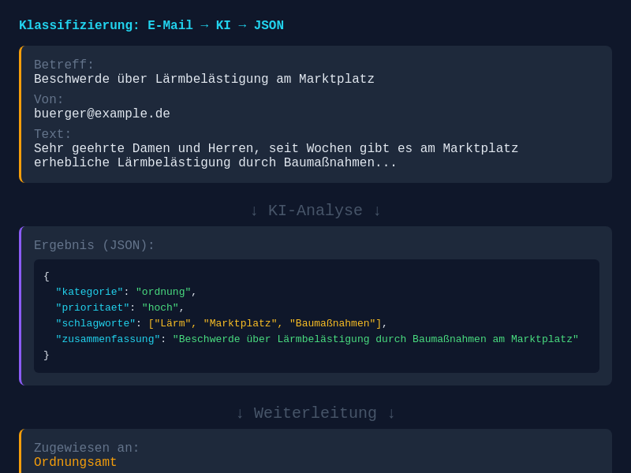
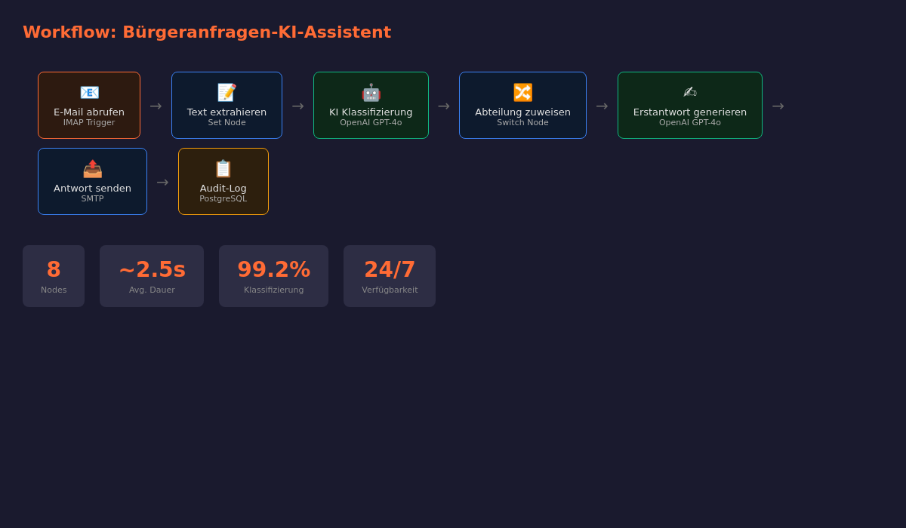
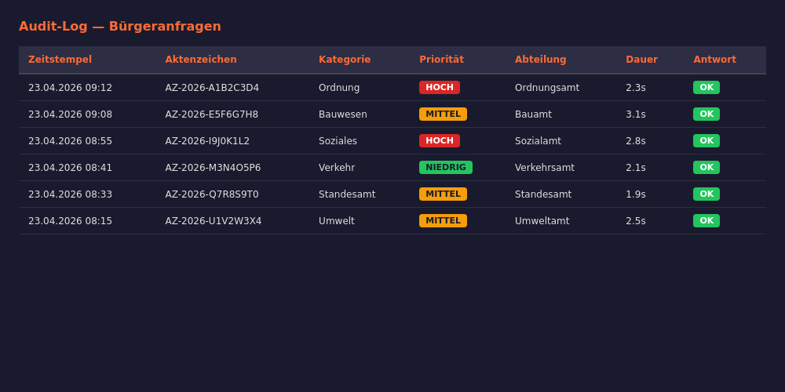

# Buergeranfragen Ki Assistent

<p align="center">

</p>

    

> KI-gestützte Bürgeranfragen-Beantwortung für Kommunen (DSGVO-konform)

## Overview

Automatische Klassifizierung und Beantwortung von Bürgeranfragen. n8n-Workflow mit PostgreSQL-Datenbank, Ollama-KI und E-Mail-Integration. Komplett self-hosted und DSGVO-konform.

## Features

- Automatische Anfragen-Klassifizierung
- KI-gestützte Antwort-Generierung
- PostgreSQL-Datenbank
- Audit-Log für Nachvollziehbarkeit
- E-Mail-Integration
- Konfigurierbare Antwort-Vorlagen

## Tech Stack

| Tech | Zweck |
|------|-------|
| n8n | Workflow-Orchestrierung |
| Ollama | Lokale KI |
| PostgreSQL | Datenbank |
| Python | Hilfsscripte |
| Docker Compose | Deployment |

## Quick Start

```bash
bash setup.sh
# oder: docker compose up -d
```

## Screenshots

**Dashboard mit Anfragenübersicht**



**KI-Klassifizierung einer Anfrage**



**Workflow-Architektur**



**Audit-Log für Nachvollziehbarkeit**



---

## Contributing

Beiträge sind willkommen! Bitte erstelle einen Issue oder Pull Request.

## License

MIT License — siehe [LICENSE](LICENSE).

<p align="center">
<a href="https://github.com/ceeceeceecee">ColeTrading</a> &bull; DSGVO-konform &bull; Self-Hosted &bull; Open Source
</p>